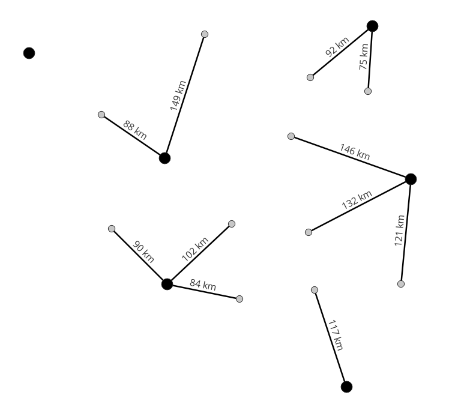

# Projekt zaliczeniowy

## Analiza bliskości (wyszukiwanie najbliższego sąsiada)

Dane są dwie warstwy punktowe:

1. `dostawcy.gpkg` (punkty główne).
2. `odbiorcy.gpkg` (punkty podrzędne).

Napisz funkcję, która wykona następujące operacje przestrzenne:

1. Dla każdego dostawcy znajdzie najbliższego odbiorcę. W tym
   celu należy zastosować zagnieżdżoną pętlę.
2. Stworzy linię między najbliższym odbiorcą a dostawcą i doda
   do warstwy atrybut z obliczoną odległością.
3. Skopiuje atrybuty w tabeli od dostawcy do odbiorcy.

Wynikiem działania funkcji powinny być:
1. Zapisana warstwa liniowa.
2. Zaktualizowana warstwa `odbiorcy.gpkg`.

### Termin

Projekt zaliczeniowy proszę wysłać do 7 lutego (piątek) na mój adres e-mail: krzysztof.dyba@amu.edu.pl
